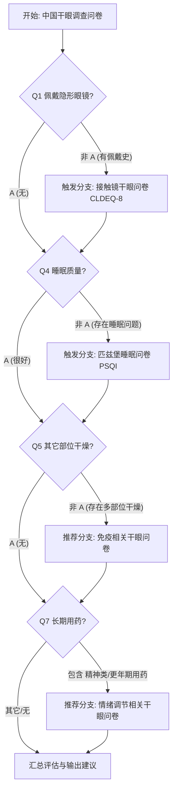

# 模块二：干眼问卷调查结构化解析与调用指南

本目录包含了干眼症 AI 医生智能体系统中**模块二（干眼问卷调查与个性化建议）**的所有结构化数据文件、分支跳转逻辑、评分规则与诊疗/生活建议算法规则。

---

## 一、 文件清单与架构说明

| 文件名 | 类型 | 说明 |
| :--- | :--- | :--- |
| `1-中国干眼调查问卷-附问题解释.docx` | 原始文档 | 中国干眼流行病学及临床调查基础问卷（含患者语言解释） |
| `1-中国干眼调查问卷-附问题解释.json` | 结构化 JSON | 13 个基础问卷条目、分支追问规则、得分映射及诊断切点 |
| `1-输出的个性化建议.docx` | 原始文档 | 诊疗分级建议及危险因素标签生活建议规则 |
| `1-输出的个性化建议.json` | 结构化 JSON | 临床前/中度/重度干眼治疗建议及 9 大危险因素标签建议库 |
| `2-生活方式相关干眼问卷.docx` | 原始文档 | 生活习惯与环境危险因素调采样表 |
| `2-生活方式相关干眼问卷.json` | 结构化 JSON | 8 大危险因素（VDT、睡眠、隐形眼镜、化妆、吸烟、防护、环境、饮食）结构化题目 |
| `3-接触镜干眼问卷-8（CLDEQ-8）.docx` | 原始文档 | 接触镜相关干眼 8 项标准问卷 |
| `3-接触镜干眼问卷-8（CLDEQ-8）.json` | 结构化 JSON | 维度加权（$Q1a+Q1b\times2$ 等）、线性转换（$Q5$ 转换）及 14 分诊断标准 |
| `4-匹兹堡睡眠问卷.pdf` | 原始文档 | 匹兹堡睡眠质量指数（PSQI）标准量表 |
| `4-匹兹堡睡眠问卷.json` | 结构化 JSON | 19 自评+5 同寝者条目、7 大成分 (Component A~G) 算式及 4 级睡眠评估 |
| `模块二_干眼问卷与个性化建议全集.json` | 整合数据库 | **Agent / 自动化引擎首选调用文件**，包含所有问卷与规则库 |
| `README_问卷与规则说明.md` | 说明文档 | 本文档，涵盖问卷引擎交互逻辑、算法推导及 Agent 上下文集成规范 |

---

## 二、 问卷动态分支跳转图 (Questionnaire Branching Graph)

在患者回答《中国干眼调查问卷》的过程中，系统将根据以下规则实时判定是否触发子问卷：

---

## 三、 各问卷计分与诊断切点算法

### 1. 中国干眼调查问卷
* **计算公式**: $\text{Total Score} = \max(\text{Score}(Q1), \text{Score}(Q2)) + \sum_{i=3}^{13} \text{Score}(Q_i)$
* **最高得分**: 48 分
* **诊断切点**:
  - `0 - 6.99 分`: 无干眼相关疾病（临床前/低风险）。
  - `≥ 7.0 分`: 干眼阳性（提示存在干眼相关疾病，需进一步分型与评估严重度）。

### 2. 接触镜干眼问卷 (CLDEQ-8)
* **维度加权得分**:
  - 不适得分 $= Q1a + (Q1b \times 2)$
  - 眼干得分 $= Q2a + (Q2b \times 2)$
  - 视力模糊得分 $= Q3a + (Q3b \times 2)$
  - 闭眼愿望得分 $= Q4$
  - 摘镜愿望转换得分 $= (Q5_{\text{raw}} - 1) \times 0.8$
* **原始总分 (Raw Total)**: 范围 `0 ~ 37.2`
* **标准总分 (Standardized Score)**: $\text{Standard\_Score} = \left(\frac{\text{Raw\_Total}}{37.2}\right) \times 100$
* **临床切点**: 标准分 $\ge 14.0$ 分判定为具有临床意义的接触镜相关干眼（CLIDE）。

### 3. 匹兹堡睡眠质量指数 (PSQI)
* **成分 A (主观睡眠质量)**: $Q6$ 得分 (`0~3`)
* **成分 B (睡眠潜伏期)**: $Q2$ 查表得分 $+$ $Q5a$ 得分，累加后映射为 `0~3` 分
* **成分 C (睡眠时间)**: $Q4$ 实际睡眠小时数映射 (>7h:0, 6-7h:1, 5-6h:2, <5h:3)
* **成分 D (习惯睡眠效率)**: $\text{效率} = \frac{Q4}{Q3 - Q1} \times 100\%$ (>85%:0, 75-84%:1, 65-74%:2, <65%:3)
* **成分 E (睡眠障碍)**: $\sum_{i=b}^{j} Q5_i$ 累加和查表映射为 `0~3` 分
* **成分 F (催眠药物)**: $Q7$ 得分 (`0~3`)
* **成分 G (日间功能障碍)**: $Q8 + Q9$ 累加和映射为 `0~3` 分
* **PSQI 总分**: $\sum (\text{Component A} \dots \text{G})$ (范围 `0 ~ 21` 分)
* **评价分级**: `0-5` 很好; `6-10` 还行; `11-15` 较差; `16-21` 很差。

---

## 四、 个性化建议引擎逻辑

建议引擎输出由两部分组成：
1. **临床诊疗建议（依据病情严重度）**
   - **临床前干眼**: 生活方式预防、定期眼检查。
   - **中度干眼**: 无防腐剂人工泪液、自身泪液促泌仪、湿房镜、抗炎滴眼液评估、泪小管栓子、保持好心态。
   - **重度干眼**: 专科就诊、眼部热敷、湿房镜高湿环境、无防腐剂人工泪液及凝胶、泪液促泌仪、抗生素预防感染。

2. **生活方式建议（依据危险因素标签）**
   - `#电子设备`: 20-20-20法则、眨眼练习、盲工作练习、湿房镜/加湿器、每周有氧运动。
   - `#接触镜佩戴`: 控时/停戴、高润湿日抛硅水凝胶、规范洗手清洁、禁过夜/游泳、专眼人工泪液。
   - `#眼部化妆`: 减频/停化、避开睑缘与睫毛根部、专用卸妆+睑缘清洁。
   - `#睡眠质量`: 规律作息、限制卧床、避免午后咖啡因/酒、控午睡<30min。
   - `#长期吸烟`: 戒烟、远离二手烟、眼部热敷按摩、促粘蛋白滴眼液。
   - `#过量饮酒`: 限酒/戒酒、补水及促分泌滴眼液。
   - `#饮食调整`: 地中海饮食（蔬菜、深海鱼、五谷、橄榄油），少高脂高热量食物。
   - `#环境因素`: 湿房镜、桌面加湿器 (40%-60%湿度)、人工泪液。
   - `#心理健康`: 心理/精神专科自测就诊、每周 3 次运动减压。

---

## 五、 AI Agent 开发调用指引

在构建 Agent 系统（如基于 LangChain、LlamaIndex 或自定义 Agent）时：
- 加载 `模块二_干眼问卷与个性化建议全集.json` 作为问卷图谱与规则引擎数据源。
- 根据用户在问卷交互过程中的实时回答，自动匹配 `branching_rules` 展开下一轮对话追问。
- 收集齐问卷选项后，调用内部 Python/JS 计算逻辑，自动生成得分、诊断分级，并精准触发对应的诊疗与生活建议列表注入给大模型作为 Final Answer 上下文。
